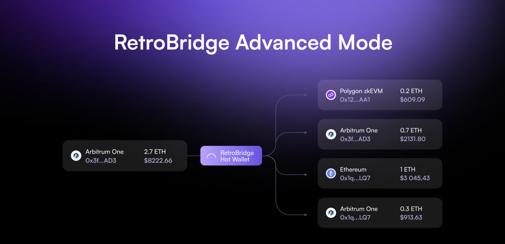

# **RetroBridge Advanced Mode**

## Description
**Advanced Mode** offers a robust solution for users to perform seamless transfers from a single source network address to multiple destination networks and addresses. 
This feature operates without the utilization of smart contracts and is based on a direct transfer function. Users send funds to our concentrated liquidity on the source chain, after which we validate the transaction and distribute the users assets to the specified networks and addresses from our hot wallets on each chain.  
  
Utilizing the transfer function, which is among the most cost-effective operations on the blockchain, helps to keep transaction fees low.

## **Execution Modes**
### **Fast Mode**
This mode executes multiple bridging orders rapidly, processing up to 50 bridges within a span of 5-10 minutes.

Due to the high load this mode imposes on our infrastructure, an additional fee may be applied.

### **Sequence Mode**
In Sequence Mode, multiple bridging orders are executed with intervals ranging from 5-15 minutes between each, thereby reducing the load on our infrastructure and avoiding performance bottlenecks.

# **RetroBridge Advanced Adventure**

**RetroBridge**, a leading cross-chain bridging solution, is hosting a 15-day campaign to highlight and celebrate the unique features of its Advanced Mode. The campaign aims to engage users in the RetroBridge community and complete various tasks to qualify for entry into the prize pool. These tasks include subscribing to RetroBridge's Twitter account, joining the RetroBridge Discord server, reposting campaign details, and conducting at least one Advanced Mode bridge operation. The initial size of the prize pool is **$25,000**. Additionally, **30% of the fees collected from Advanced Mode usage** will be added to the prize pool, further enhancing the rewards for participants.

To ensure fairness and transparency in selecting the campaign winners, RetroBridge has established this repository to house the randomizer tool.

